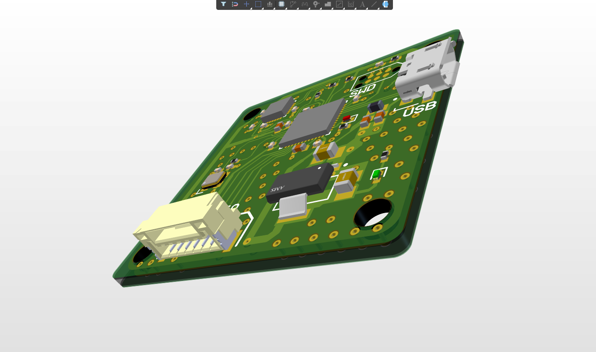
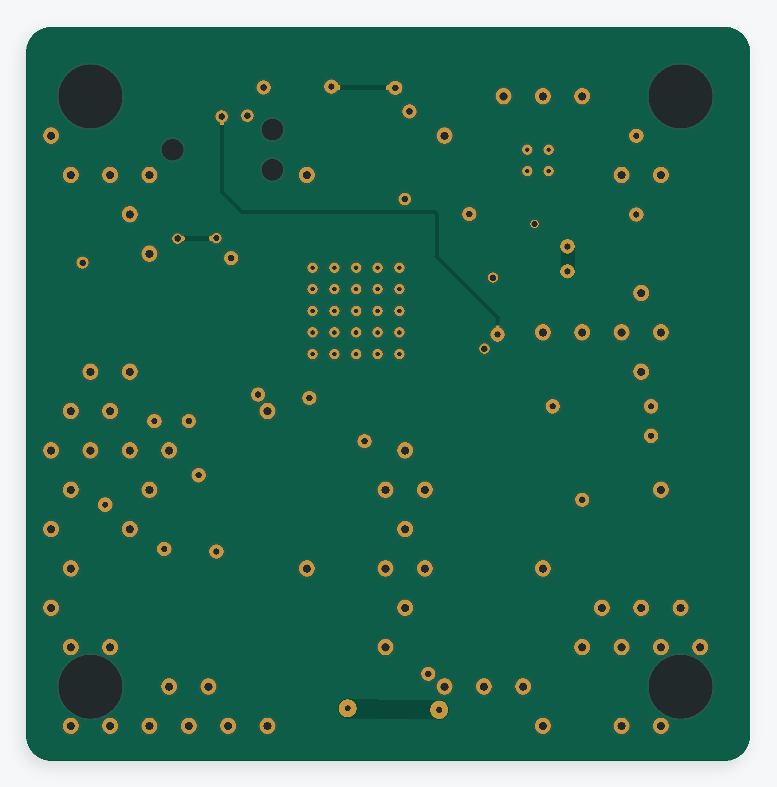
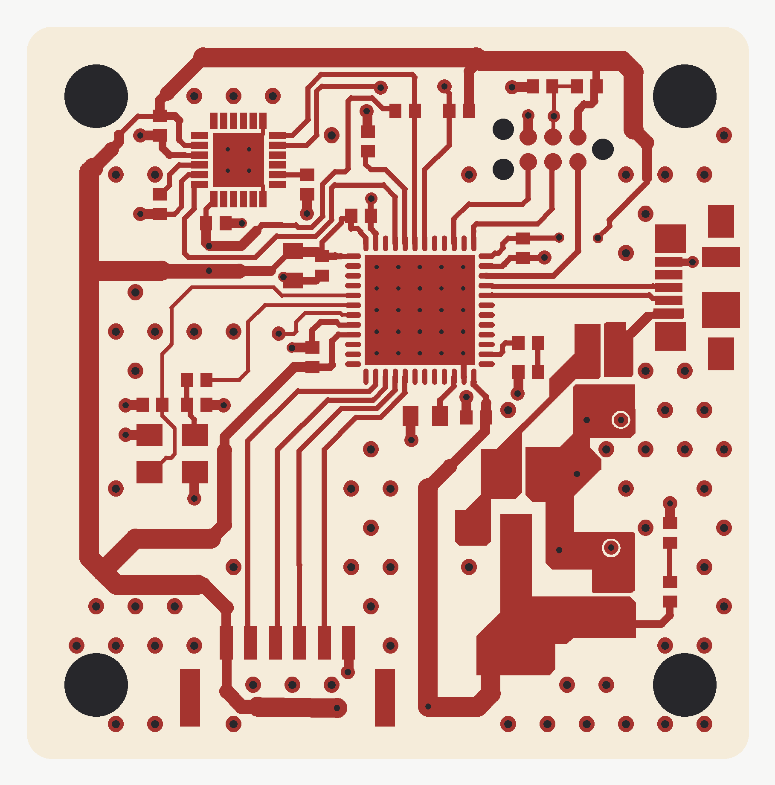
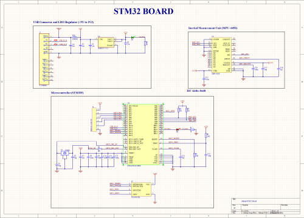

# STM32F411 IMU PCB Design

A four-layer PCB design in Altium Designer built around the **STM32F411CEU6** microcontroller and an **MPU-6050** inertial measurement unit (IMU). The repository contains the editable Altium design, STM32CubeMX pin configuration, bill of materials, Gerber X2 exports, and design visualizations.

> **Project status:** Designed only. This board has **not** been manufactured, assembled, powered, or tested. The included Gerbers are design exports for review, not a validated fabrication release. The saved design rule check reports 153 unwaived violations; see [Design status](DESIGN_STATUS.md) before considering fabrication.

*Altium Designer 3D view showing the intended component placement. This is a CAD rendering, not a photograph of a manufactured or assembled board. See the [unpopulated top-side view](images/board_top.png) for the Gerber-derived artwork.*

## Design overview

| Item | Design detail |
|---|---|
| Microcontroller | STM32F411CEU6, as listed in the BOM |
| Motion sensor | MPU-6050 accelerometer and gyroscope; I2C1 uses PB6 (SCL) and PB7 (SDA) in the supplied `.ioc` file |
| USB and power | Micro-USB connector and AMS1117-3.3 regulator; PA11/PA12 are configured for USB FS in STM32CubeMX |
| Debug and I/O | SWD signals on PA13/PA14; a six-position connector and LED footprints are included |
| Clock | 24 MHz crystal listed in the BOM |
| PCB | Four copper signal layers; outline approximately 37 × 37 mm |

The `.ioc` file also assigns PB8 as `IMU_INT` and PB13 as a GPIO output named `LED`. It is a peripheral configuration file; **no firmware is included** in this repository.

## PCB and schematic images

| Bottom side, viewed from underneath | Top copper routing |
|---|---|
|  |  |

*The schematic thumbnail is a low-resolution preview saved with the Altium project. Open the `.SchDoc` file in Altium for readable schematic details. The top and bottom flat board previews are derived from the supplied Gerber exports.*

## Files

| Path | Contents |
|---|---|
| `AltiumSTM32.PrjPcb` | Altium Designer project |
| `AltiumSTM32_Schematic.SchDoc` | Editable schematic |
| `AltiumSTM32_PCB.PcbDoc` | Editable PCB layout |
| `AltiumSTM32.ioc` | STM32CubeMX pin and peripheral configuration |
| `images/` | Altium 3D screenshot, flat top and bottom Gerber previews, top copper plot, and schematic thumbnail |
| `bom/Bill_Of_Materials.csv` | Supplied component list |
| `gerbers/` | Supplied Gerber X2 layer and drill exports |
| `reports/Design_Rule_Check_2026-09-13.drc` | Saved DRC report with its local file path removed |
| `DESIGN_STATUS.md` | Design review findings and limits |

## Open and review the design

1. Open `AltiumSTM32.PrjPcb` in Altium Designer to inspect the schematic and PCB.
2. Review the BOM and the Gerber files against the Altium source. The original project references two external Altium libraries named `Schematic-Lib-PhilsLab.SchLib` and `Footprint-Lib-PhilsLab.PcbLib` in a neighboring folder; those library files were not supplied and are not included here.
3. If you modify the design or plan to manufacture it, resolve the remaining design rule violations, verify the schematic and footprints, and regenerate and inspect all manufacturing outputs.

See [Design status](DESIGN_STATUS.md) for the saved DRC findings. Physical function and fabrication suitability have not been verified.

## Credits

The original Altium project references schematic and footprint libraries named for **Phil's Lab**. Thanks to [Phil's Lab (Philip Salmony)](https://github.com/pms67) for sharing PCB design resources. The referenced external library files were not part of the supplied project archive and are not included in this repository.
